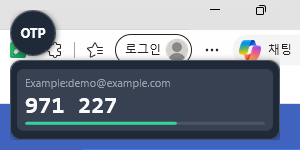

# OtpWidget

**바탕화면에 항상 떠 있는 작은 OTP(2단계 인증) 위젯** — 평소엔 작은 아이콘, 마우스를 올리면 코드가 펼쳐지고, 클릭하면 복사.

A tiny always-on-top desktop TOTP widget for Windows. Hover to expand, click a code to copy. No installation, no admin rights. *(English below)*



## 왜 만들었나
브라우저 확장 Authenticator는 매번 클릭하고 팝업이 뜨길 기다려야 해서 불편했습니다. 바탕화면 한 구석에 항상 떠 있으면서 마우스만 올리면 바로 보이는 위젯이 필요했습니다.

## 기능
- 항상 맨 위에 떠 있는 작은 원형 `OTP` 아이콘
- 마우스를 올리면 아래로 계정별 코드가 펼쳐지고, 벗어나면 자동으로 접힘
- 코드를 클릭하면 클립보드에 복사 (`Copied!` 표시)
- 남은 시간 바 (5초 이하면 빨간색)
- **QR 코드 등록**: 화면에 QR이 보이는 상태에서 우클릭 → *화면의 QR 코드 스캔* 하면 바로 추가
- otpauth 링크 / 시크릿 키 직접 붙여넣기도 가능
- 드래그로 위치 이동 (위치 기억), 윈도우 시작 시 자동 실행 가능

## 설치 & 실행

### 방법 A. 실행 파일 (권장)
1. **[OtpWidget.zip 다운로드](https://github.com/junhyuckkkk/OtpWidget/raw/main/dist/OtpWidget.zip)** (또는 [Releases](../../releases))
2. 압축을 풀고 `OtpWidget.exe` 더블클릭

> **경고가 뜨는 이유**: 코드 서명이 없는 개인 프로젝트라서 브라우저와 Windows가 처음 보는 파일로 취급합니다.
> - 엣지에서 "일반적으로 다운로드되지 않습니다"가 뜨면: 다운로드 항목의 `⋯` → **유지** → **자세히 보기** → **그래도 유지**
> - 실행 시 Windows SmartScreen 창이 뜨면: **추가 정보 → 실행**
>
> 불안하면 zip 안에 같이 들어 있는 `OtpWidget.vbs`를 더블클릭해 스크립트 버전으로 실행하세요. exe와 기능이 같고, 소스(`OtpWidget.ps1`)를 직접 읽어볼 수 있습니다.

### 방법 B. 스크립트 그대로 실행 (설치 없음)
1. 이 저장소를 다운로드(Code → Download ZIP) 후 압축 해제
2. `OtpWidget.vbs` 더블클릭 (콘솔 창 없이 실행됨)

## 계정 등록

### 1) QR 코드로 (가장 쉬움)
1. 사이트에서 2단계 인증 QR 코드를 화면에 띄움
2. 위젯 아이콘 **우클릭 → 화면의 QR 코드 스캔**
3. 끝. 바로 목록에 추가됩니다.

QR을 캡처(Win+Shift+S)해 둔 경우엔 **계정 추가… → 클립보드 이미지에서 QR 읽기**.

### 2) 링크나 키를 직접 붙여넣기
아이콘 **우클릭 → 계정 추가…** 에서 `otpauth://totp/...` 링크 또는 시크릿 키(예: `JBSW Y3DP EHPK 3PXP`)와 이름을 입력.

### 3) 백업 파일로 한꺼번에 가져오기
브라우저 확장 **Authenticator** 등에서 *백업 → 내보내기*로 받은 파일을 아이콘 **우클릭 → 백업 파일 가져오기…** 에서 선택하면 끝. 파일 안의 `otpauth://` 링크를 전부 찾아 등록하고, 이미 있는 계정은 건너뜁니다 (txt, json 모두 가능).

파일 대신 내용을 복사해 둔 상태라면 **계정 추가…** 창의 입력칸에 여러 줄을 그대로 붙여넣고 *추가* 해도 됩니다.

`secrets.txt`를 직접 편집했다면 우클릭 → **새로고침**.

## 윈도우 시작 시 자동 실행
아이콘 **우클릭 → 윈도우 시작 시 자동 실행** 체크. 시작프로그램 폴더(`shell:startup`)에 바로가기가 생기고, 체크를 풀면 삭제됩니다.

## 파일 구성
| 파일 | 설명 |
|---|---|
| `OtpWidget.ps1` | 위젯 본체 (PowerShell + WPF, 단일 파일) |
| `OtpWidget.vbs` | 콘솔 창 없이 실행하는 런처 |
| `secrets.txt` | 내 계정 목록 (직접 생성, **git에 올라가지 않음**) |
| `secrets.example.txt` | 샘플 |
| `state.json` | 위젯 위치 (자동 생성) |
| `lib/zxing.dll` | QR 디코더. 첫 QR 스캔 때 [ZXing.Net](https://github.com/micjahn/ZXing.Net) (NuGet)에서 자동 다운로드 |
| `build.ps1` | `dist\OtpWidget.exe` 빌드 (ps2exe 사용) |

## 보안 주의
- 시크릿은 `secrets.txt`에 **평문**으로 저장됩니다. 공유 PC나 클라우드 동기화 폴더에는 두지 마세요.
- 위젯은 네트워크에 아무것도 보내지 않습니다. (QR 라이브러리 최초 다운로드 1회 제외)
- 자리를 비울 땐 Win+L.

## 직접 빌드
```powershell
.\build.ps1
```
ps2exe가 없으면 PowerShell Gallery에서 자동으로 받아 `dist\OtpWidget.exe`를 만듭니다.

---

## English

A tiny always-on-top TOTP widget for Windows, written as a single PowerShell + WPF script. The UI is in Korean.

- Small round `OTP` icon; hover to expand the list of codes, move away to collapse
- Click a code to copy it
- Countdown bar per account
- Add accounts by **scanning a QR code that is visible on screen** (right-click → *Scan QR on screen*), from a clipboard image, or by pasting an `otpauth://` link / secret key
- Bulk import: paste exported `otpauth://` lines (e.g. from the Authenticator browser extension) into `secrets.txt`
- Right-click → *Start with Windows* to toggle autostart

**Run:** [download `OtpWidget.zip`](https://github.com/junhyuckkkk/OtpWidget/raw/main/dist/OtpWidget.zip), unzip, run `OtpWidget.exe` (or `OtpWidget.vbs` for the script version). No install, no admin.
Secrets are stored in plain text in `secrets.txt` next to the executable; keep that folder private.
QR decoding uses [ZXing.Net](https://github.com/micjahn/ZXing.Net), downloaded from NuGet on first use.

License: MIT
